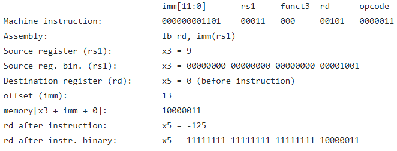

# RISC-V_Simulator

This project aims to create a RISC-V instruction set simulator (ISS).

### RV32I As described in the specification:

"Although it is convenient to speak of the RISC-V ISA, RISC-V is actually a family of related ISAs, of which there are currently four base ISAs. Each base integer instruction set is characterized by the width of the integer registers and the corresponding size of the address space and by the number of integer registers. There are two primary base integer variants, RV32I and RV64I ..."

Currently I'm only interested in implementing RV32I. Eventually I will look into adding extensions later (such as multiplication, division, floating point numbers etc.) and perhaps the RV64I, but for now I just want to get the project off of the ground.

### Current progress 

Instructions were first manually entered via simulator code (a.k.a. 0's and 1's) directly into memory. This was done to test that each instruction was being interpreted properly by the simulator [sample instructions](https://github.com/satchelfrost/RISC-V_Simulator/blob/master/src/testInstr.h). Registers were also set to arbitrary values if source or destination registers were needed for that particular instruction. Although it looks like I'm biased in using registers x3 and x5, this was an unintentional cosequence of copying and pasting. In reality, any of the 32 registers will work as long as the proper binary is in the proper instruction field. See the RISC-V specification under instruction set listings for details on each field. 

In the future I'd like to make an assembler rather than manually entering 0's and 1's!

For debug purposes this interpretation was then logged to [sample ouput](https://github.com/satchelfrost/RISC-V_Simulator/blob/master/sampleOutput) where you can see the output printed. As an example, if the instruction fetched is "00000000110100011000001010000011" the sample output in debug-mode will be as follows:

Note that the field for the source register rs1 is "00011" in this case. The interpreter knows this and accordingly prints "x3 = ...", any register will work though. In this particular case rd (x5) happened to be equal to 0 before the instruction was executed. This was because all registers are initialized to zero when the simulator starts, but if this were not the first instruction executed then the value contained would of course be based on the previous state of the program. Each instruction will have their own relevant information printed.  When not in debug-mode the instruction will simply be executed without any printing / logging. 
